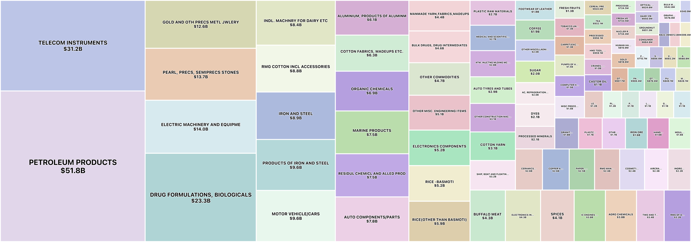
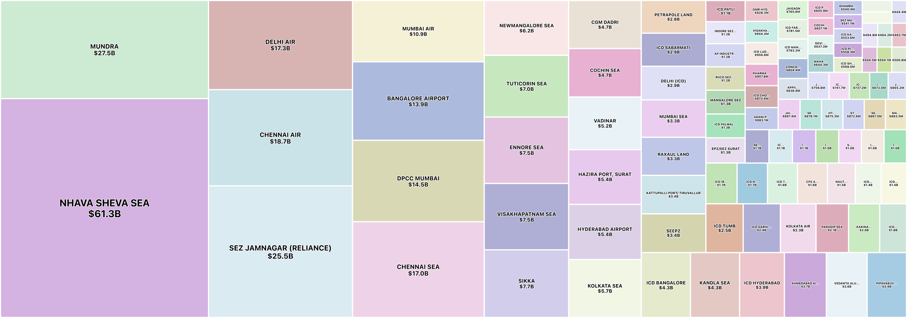
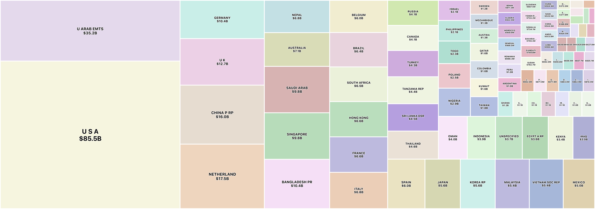

# india-export-import

Dataset of commodity export and import activity in India. Sourced from the [Foreign Trade Data Dissemination Portal](https://ftddp.dgciskol.gov.in/dgcis/principalcommditysearch.html).

Explore the dataset [here](https://india-export-import.pages.dev).

## Data

* [export-import.parquet](https://github.com/Vonter/india-export-import/releases/latest/download/export-import.parquet): Commodity export and import activity in India as Parquet file.
* [export-import.csv.gz](https://github.com/Vonter/india-export-import/releases/latest/download/export-import.csv.gz): Commodity export and import activity in India as compressed CSV file.

For more details, refer to the [DATA.md](DATA.md).

## Visualizations

The source code for the dataset visualization tool is in the [viz](viz) directory.

#### Top commodity by export in 2025

[](http://india-export-import.pages.dev/?mode=Commodity&tradeMode=Export&year=2025)

#### Top port by export in 2025

[](http://india-export-import.pages.dev/?mode=Port&tradeMode=Export&year=2025)

#### Top country by export in 2025

[](http://india-export-import.pages.dev/?mode=Country&tradeMode=Export&year=2025)

## Scripts

- [fetch.py](fetch.py) Fetches the raw data from the Foreign Trade Data Dissemination Portal
- [parse.py](parse.py): Parses the raw data to generate the Parquet and compressed CSV dataset
- [data.py](data.py): Generates the frontend files for the dataset visualization tool

## License

This india-export-import dataset is made available under the Open Database License: http://opendatacommons.org/licenses/odbl/1.0/. 
Some individual contents of the database are under copyright by DGCIS.

You are free:

* **To share**: To copy, distribute and use the database.
* **To create**: To produce works from the database.
* **To adapt**: To modify, transform and build upon the database.

As long as you:

* **Attribute**: You must attribute any public use of the database, or works produced from the database, in the manner specified in the ODbL. For any use or redistribution of the database, or works produced from it, you must make clear to others the license of the database and keep intact any notices on the original database.
* **Share-Alike**: If you publicly use any adapted version of this database, or works produced from an adapted database, you must also offer that adapted database under the ODbL.
* **Keep open**: If you redistribute the database, or an adapted version of it, then you may use technological measures that restrict the work (such as DRM) as long as you also redistribute a version without such measures.

## Generating

Ensure that `python` and the required dependencies in `requirements.txt` are installed.

```
# Fetch the raw data
python fetch.py

# Parse the raw data
python parse.py

# Generate the frontend files
python data.py
```

## Credits

- [Foreign Trade Data Dissemination Portal](https://ftddp.dgciskol.gov.in/dgcis/principalcommditysearch.html)

## AI Declaration

Components of this repository, including code and documentation, were written with assistance from Claude AI.
